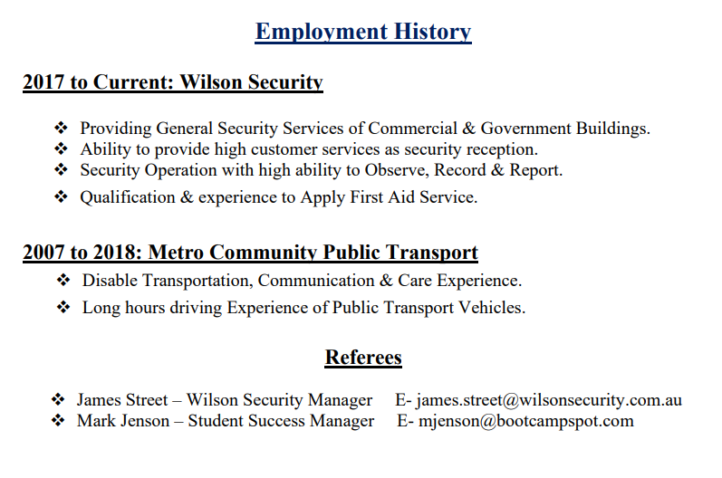

# Title

- Portfolio-Challenge

## Descripition

- This portfolio app describes about myself.
- I have lived in Perth Western Australia since 2004. I have family & father of 2 children.
- It's part of my resume with my contact details and planing to improved it with more updated information.

## Installation

- This application ia a web browser App to access my portfolio and
  user could run it in any devices using the following link.

- [The URL of GitHub Repository](https://github.com/Tesfa8186/Tesfa-PortfolioWebpage)

- [The URL of my Portfolio Page](http://127.0.0.1:5500/Tesfa-PortfolioWebpage/index.html)

## Usage

The use of this application is to access portfolio details online.

## Links

- 
- 
- My Email: tesfa1978@gmail.com & My Github: Tesfa8186

## Licence

- 

- @2023 All Rights Reserved at tesfa1978@gmail.com
